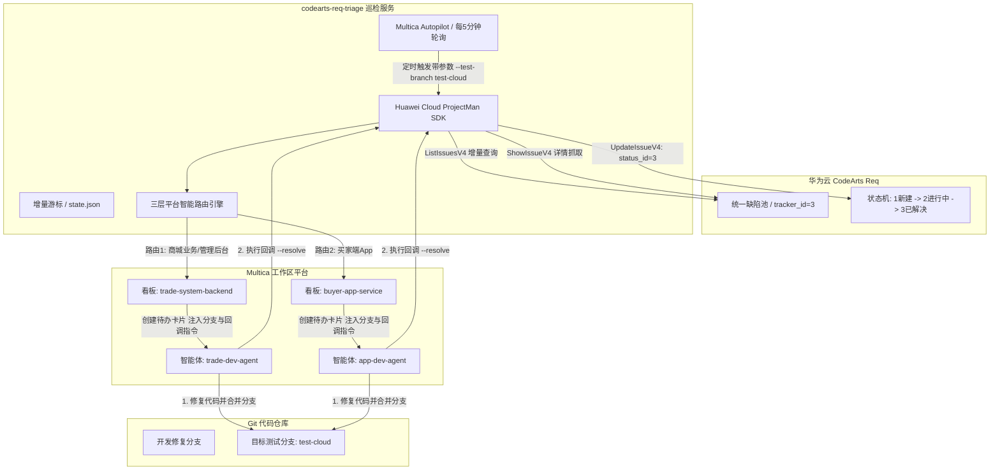
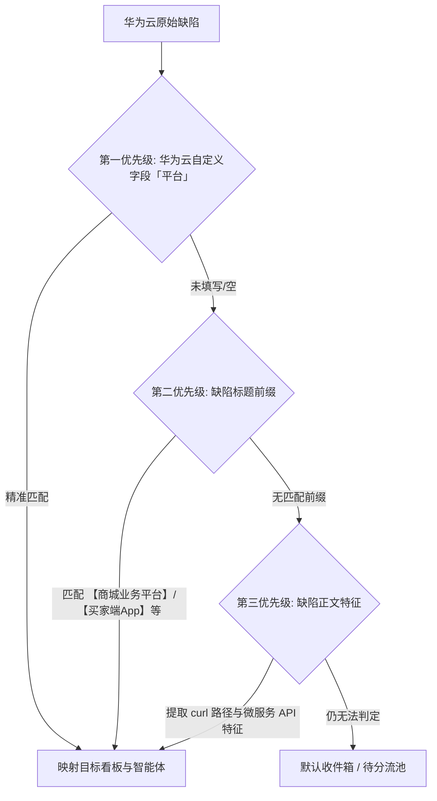

# Multica 与华为云 CodeArts Req 缺陷自动化分诊与双向流转集成指南

## 一、方案概述与设计背景

在研发协作中，缺陷往往统一提交在华为云 CodeArts Req（需求管理平台）的缺陷池中。传统协作模式下，开发团队需要人工轮询华为云、逐一审阅缺陷、在看板重新录入卡片并分派给对应责任人；修复后，又需人工跨平台回到华为云更新状态，链路长且易遗漏。

本项目基于 **华为云官方 OpenAPI (ProjectMan SDK)** 与 **Multica 智能体工作区平台**，构建了一套端到端的缺陷智能分诊与双向协同流转系统：
1. **自动增量拉取**：定时通过华为云官方 API 增量扫描缺陷池，杜绝漏单与重单；
2. **AI 智能分诊**：按业务规则提取模块、建议严重级、提取报错特征与 API 路径；
3. **三层多平台智能路由**：自动识别混合缺陷池中的不同子业务（如 商城业务平台、买家端App、运营管理后台），自动映射投递至 Multica 对应看板；
4. **确定性智能体指派**：自动分配给专属领域智能体（如 `trade-dev-agent`、`app-dev-agent`）进行代码排查与修复；
5. **动态测试分支合流与状态闭环回调**：支持在定时任务中动态配置目标测试分支（如 `--test-branch test-cloud`），智能体排查修复后，自动将代码合并至目标分支，并一键回调华为云将缺陷状态标记为「已解决」。

---

## 二、端到端系统架构与时序图

### 1. 架构总览



### 2. 核心 OpenAPI 端点说明

巡检程序 100% 走华为云官方 OpenAPI 规范，由官方 `huaweicloudsdkcore` 在请求头中自动生成 `SDK-HMAC-SHA256` 安全签名：

| 接口名称 | OpenAPI 规范端点 | 功能用途 |
| :--- | :--- | :--- |
| **查询工作项列表** | `POST /v4/projects/{project_id}/issues` (`ListIssuesV4`) | 带增量时间区间 (`updated_time_interval`) 批量拉取缺陷 |
| **查询工作项详情** | `GET /v4/projects/{project_id}/issues/{issue_id}` (`ShowIssueV4`) | 获取缺陷富文本正文、curl 参数、自定义字段及当前处理人 |
| **更新工作项/状态** | `PUT /v4/projects/{project_id}/issues/{issue_id}` (`UpdateIssueV4`) | 回写 AI 分诊结论，或回调修改状态为「已解决」(`status_id: 3`) |

---

## 三、多平台智能路由分发机制

由于多个业务系统共用华为云同一个大项目 ID（如 `a1b2c3d4e5f678901234567890abcdef`），系统设计了**三层漏斗式优先级匹配**，确保准确投递：

### 1. 三层判定规则



1. **第一优先级（优先）**：华为云缺陷模板中的「平台」自定义字段（单选值：`商城业务平台` / `买家端App` / `运营管理后台`）；
2. **第二优先级（次选）**：缺陷标题前缀（如包含 `【商城业务平台】`、`【买家端App】`、`【运营管理后台】`）；
3. **第三优先级（兜底）**：正文中携带的 `curl` 命令行、微服务前缀（如 `/trade/`、`/app/`、`/admin/` 等）。

### 2. 看板与智能体分发映射表（示例）

| 识别归属平台 | 目标 Multica 看板 | 目标智能体负责人 | 智能体职责 |
| :--- | :--- | :--- | :--- |
| **商城业务平台** | `trade-system-backend` | 🤖 **`trade-dev-agent`** (`uuid-aaaa`) | 排查订单交易、支付中台、前端交互问题 |
| **买家端App** | `buyer-app-service` | 🤖 **`app-dev-agent`** (`uuid-bbbb`) | 排查移动端 API、客户端上报、云服务接口问题 |
| **运营管理后台** | `admin-portal-service` | 🤖 **`admin-dev-agent`** (`uuid-cccc`) | 排查运营管理后台、权限配置与报表问题 |

---

## 四、动态测试分支与修复交付规范

为了适应不同项目或环境变动（例如测试分支由 `test-cloud` 调整为 `test`、`staging` 等），系统支持在**定时任务或环境变量中动态指定目标测试分支**，并在生成 Multica 卡片时自动注入对应的合流与回调指引。

### 1. 动态分支参数配置

- **命令行参数**：`--test-branch <branch_name>`（别名 `--target-branch`，默认 `test-cloud`）
- **环境变量**：`TEST_BRANCH=test-cloud`

### 2. 自动注入的任务卡片交付指南

每个由华为云同步过来的任务卡片末尾，均会自动附带可执行的交付规范：

```markdown
### 🛠 缺陷处理与交付规范（处理完毕后必须执行）
1. **代码提交与分支合流**：排查并修复代码后，将修改提交并合并推送到目标测试分支 **`test-cloud`**（可使用命令 `python git_flow.py -b test-cloud` 或手动执行 git merge 推送）；
2. **华为云缺陷状态回调**：分支合流完成后，必须执行以下指令将华为云 Bug #71082376 状态更新为「已解决」：
   ```bash
   python main.py --hw-project a1b2c3d4e5f678901234567890abcdef --resolve 71082376
   ```
3. **看板任务交付**：确认华为云状态更新完成后，将本 Multica 任务卡片状态变更为 `in_review`。
```

---

## 五、状态闭环：自动回调华为云（标记已解决）

### 1. 华为云 CodeArts Req 缺陷状态字典

| 状态 ID (`status_id`) | 状态名称 | 状态阶段 |
| :---: | :--- | :--- |
| `1` | 新建 | 开始态 |
| `2` | 进行中 | 进行态 |
| **`3`** | **已解决**（已处理） | 进行态 |
| `4` | 测试中 | 进行态 |
| `5` | 已关闭 | 结束态 |
| `6` | 已拒绝 | 结束态 |

### 2. 自动化回调闭环方案

在排查修复智能体的工作流规范中执行回调：
- 当智能体定位并修复代码、提交并合并入 `--test-branch` 对应分支后，在终端执行：
  ```bash
  python main.py \
    --hw-project a1b2c3d4e5f678901234567890abcdef \
    --resolve <HW_BUG_ID>
  ```
- 命令执行后秒级生效：华为云上的缺陷状态立即被置为 **「已解决」 (`status_id: 3`)**，同时 Multica 看板卡片完成流转，实现全自动跨平台闭环。

### 3. 测试打回与原任务续跑

系统以 CodeArts Bug ID 作为稳定外部键，并同时保存本地映射与 Multica Issue 元数据。每次同步前都会查询现有任务（包含已关闭任务），确保一个 Bug 始终复用同一张 Multica 卡片。

1. 测试将状态改回「新建」(`1`) 或「进行中」(`2`)：巡检在原任务追加通知，并对原智能体执行 `multica issue rerun`。
2. 测试不改状态：必须新增 CodeArts 评论并写明未通过原因；巡检检测最新评论 ID 的变化后，以相同方式续跑原任务。
3. 原任务处于 `in_progress` 时只追加反馈，避免产生并发 run；成员负责的任务则回到 `todo` 收件箱。
4. 程序通过 `--resolve` 主动写入「已解决」后，会保存来源快照，下一轮不会把自身写回当作测试打回。

如果状态、正文和评论均没有变化，轮询端没有新事件可识别，不会触发重复执行。

---

## 六、部署与运行配置

### 1. 环境变量配置 (`.env`)

敏感凭据通过环境变量注入，绝不提交至代码仓库：

```bash
# ===== 华为云 CodeArts Req 配置 =====
HW_PROJECT_ID=a1b2c3d4e5f678901234567890abcdef
HW_REGION=cn-north-4

# ===== IAM 访问凭据 (AK/SK) =====
HW_AK_READ=your_read_ak
HW_SK_READ=your_read_sk
HW_AK_WRITE=your_write_ak
HW_SK_WRITE=your_write_sk

# ===== 轮询与写回 =====
TRACKER_IDS=3
POLL_INTERVAL_SECONDS=300
LOOKBACK_SECONDS=60
WRITEBACK_ENABLED=true
TRIAGE_FIELD_NAME=AI分诊

# ===== Multica 平台联动 =====
MULTICA_SYNC_ENABLED=true
MULTICA_SYNC_HANDLERS=dev_user1
TEST_BRANCH=test-cloud
```

### 2. Multica 定时任务 (Autopilot) 配置

在 Multica 中创建每 5 分钟触发一次的 Autopilot 巡检任务：
- **Cron 表达式**：`*/5 * * * *`
- **执行指令**：
  ```bash
  python /path/to/codearts-req-triage/main.py \
    --once \
    --hw-project a1b2c3d4e5f678901234567890abcdef \
    --handlers dev_user1 \
    --test-branch test-cloud
  ```
- **参数动态性说明**：
  若未来测试分支变更为 `test` 或其他分支，无需改动任何代码，只需在定时任务指令中直接调整 `--test-branch <新分支>` 即可，创建的任务卡片会自动包含更新后的合流指令！

---

## 七、常见问题排查与运维建议

1. **同名歧义（Agent 与 Squad 重名）**：
   - **机制**：程序内置 `resolve_assignee_id` 自动解析，优先将名称转换为智能体专属 UUID（如 `--assignee-id <uuid>`），从根源杜绝歧义。
2. **华为云项目中未配置「AI分诊」自定义字段**：
   - **机制**：巡检客户端具备安全嗅探保护，若华为云项目未配置该字段槽位，自动跳过字段回写，绝不阻断 Multica 任务卡片的生成与分发。
3. **状态持久化隔离**：
   - **机制**：游标状态文件 `state_{project_id}.json` 锁定在工程当前路径，避免不同运行环境丢失增量水位。
